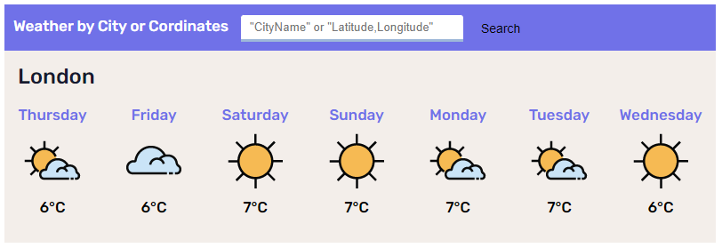

# Weather Forecast

This is a Javascript Native project which present an Average Weather Forecast for the next two week.



## Which Search Parameters are Supported ?

- Search a City by Name
- Search by Coordinates - "Latitude,Longitude" (eg. "38.9697,-77.385")

## How to Implemnt Solution ?

1. Add to your HTML file a new Script tag. The script includes two *Optinal attrbiutes*. 

2. Add Valide key into `API_KEY` parameter inside the relevant javascript file.


`src` relevant if you want to import the code from external Javascrip file.

`data-div-weather-id` use to implement the Weather Container inside specific Div via *Id* otherwise it will appened to *Body* of HTML.

```sh
<script src="index.js" data-div-weather-id="test"></script>

...
const API_KEY = [YourKey]
...
```


## Which Source I use

Visual Crossing Free API - https://www.visualcrossing.com